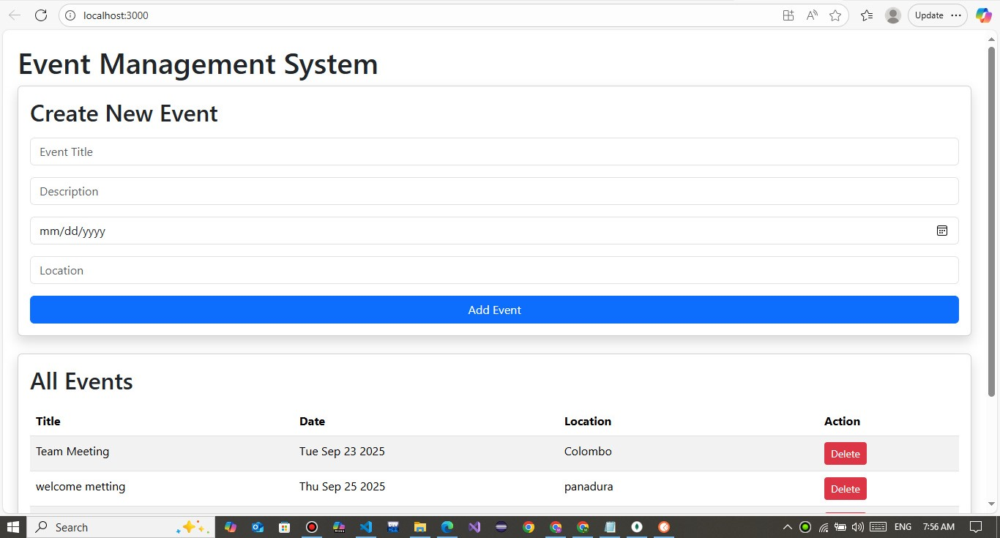
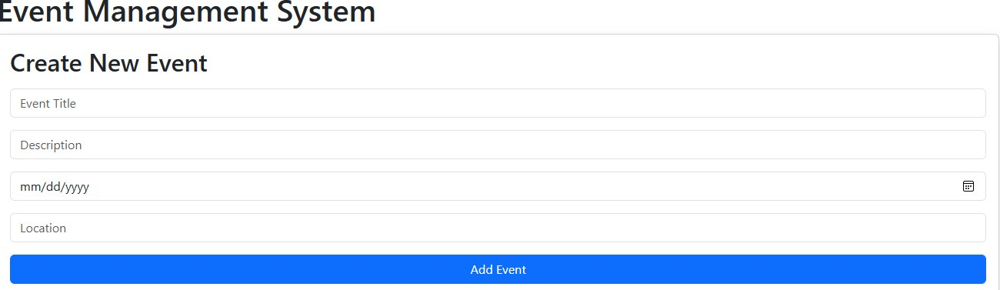
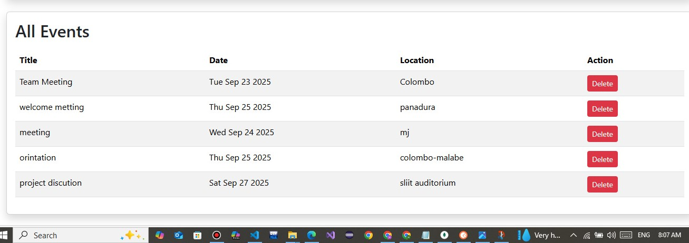
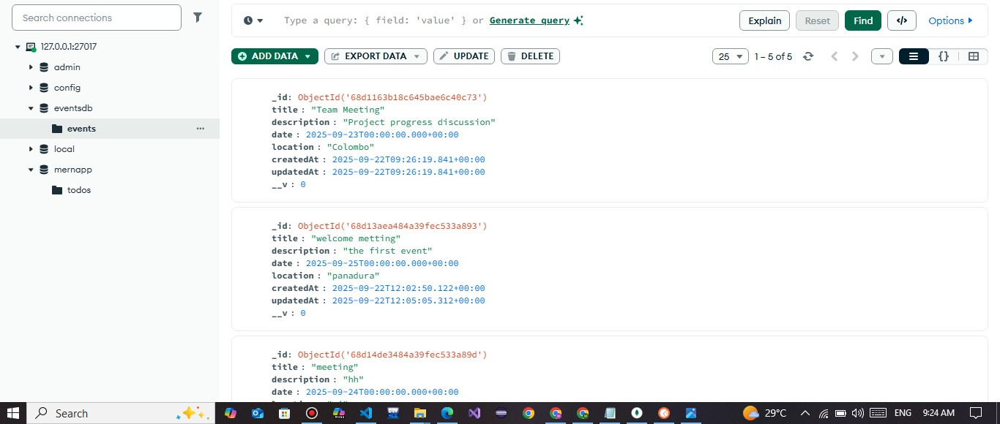
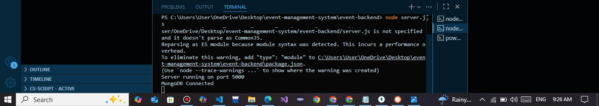

# Event Management System 

##  Project Description
The **Event Management System** is a MERN (MongoDB, Express.js, React.js, Node.js) stack application that allows users to manage events.  
Users can **Create, View, Update, and Delete (CRUD)** events easily with a simple interface.  

This project is designed for learning full-stack development and demonstrates how to connect a React frontend with a Node.js + Express backend and MongoDB database.

##  Setup Instructions
### Backend
```bash
cd event-backend
npm install
node server.js

## frontend
cd event-frontend
npm install
npm start

## API Endpoints
GET /api/events → Get all events

POST /api/events → Create a new event

PUT /api/events/:id → Update an event

DELETE /api/events/:id → Delete an event

##Technologies Used
Frontend: React.js, Axios, Bootstrap

Backend: Node.js, Express.js

Database: MongoDB

Version Control: Git + GitHub

## Install dependencies:
npm install

## Create a .env file in event-backend and add:
MONGO_URI=mongodb://127.0.0.1:27017/eventsdb

## Challenges Faced
Fixed GitHub submodule problem when pushing frontend code
Understood how to connect .env for MongoDB database
we faced an issue where the backend couldn’t connect to MongoDB.
Axios initially failed due to wrong API paths. We solved this by using correct endpoints(http://localhost:5000/api/events).


## Screenshotes








